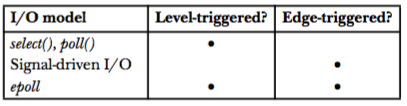

##Nonblocking I/O
当我们打开文件时启用了O_NONBLOCK, 那么不能及时完成的I/O system call会返回错误而不是阻塞.

Nonblocking I/O可以让我们定时的去检查(poll) 某个文件描述符已经准备好I/O. 

但是用线程或者进程去检查I/O太浪费系统资源, 可以用以下三种代替:

* I/O multiplexing, I/O 多路复用使用select() and poll()
* Signal-driven I/O 信号驱动的I/O, 内核会在I/O 准备好时通过发送信号通知进程. 当监视大量文件描述符时, 它比select() and poll() 性能高很多.
* Linux 2.6之后的epoll.当监视大量文件描述符时,性能比poll()强出太多.

epoll的劣势在于它是linux独有的API, 跟Signal-driven I/O相比的优势在于:
 
- 处理各种信号太复杂
- 可以选择监视的类型(可读, 或者可写)
- 可以选择是水平触发 level-triggered 或边缘触发edge-triggered

##水平触发和边缘触发
* 水平触发(level-trigger): 文件描述符可以进行非阻塞的I/O操作了.这意味者我们可以在任意时刻去检查这个描述符是否可用.

* 边缘触发(edge-trigger): 自从上次监视后, 该文件描述符有了I/O活动. 所以当收到通知时, 程序应该对其做尽可能多的I/O操作(尽可能的多读一些bytes), 不然的话就得等到下一次通知了
下面是三中I/O使用的通知模型:



##I/O multiplexing
select函数阻塞直到至少有一个就绪的文件描述符, 或者超时.

```
#include<sys/time.h>
#include<sys/select.h>
int select(int nfds, fd_set *readfds, fd_set *writefds, fd_set
			*execptfds, struct timeval *timeout);
返回就绪文件的数目, 0 代表timeout, -1 代表出错
```

* readfds是一组用来检查是否可读的文件
* writefds是一组检查是否可写的文件
* execptfds是一组看是否有execption发生的文件
* nfds必须大于以上三组描述符的最大值,内核不会去检查比这个大的文件描述符, 以此来提升速度.
操作fd_set的函数:

poll函数和select功能差不多,调用的方式不同

```
#include<poll.h>
int poll(struct pollfd fds[], nfds_t nfds, int timeout);
返回就绪文件的数目, 0 代表timeout, -1 代表出错
```
fds是一个pollfd数组, 每个pollfd的结构如下

```
struct pollfd {
	int fd; /* File descriptor */
	short events; /* Requested events bit mask */
	short revents; /* Returned events bit mask */
}
```
###例子
下面是一个简单的例子,创建10个pipes然后随机向其中三个写:

```
$./a.out 10 3
Writing to fd:  10 (read fd:   9)
Writing to fd:  10 (read fd:   9)
Writing to fd:   8 (read fd:   7)
poll() returned: 2
Readable: 2   7
Readable: 3   9
```
```
#include <stdio.h>
#include <stdlib.h>
#include <time.h>
#include <poll.h>

int main(int argc, char *argv[]) {
    int numPipes, j, ready, randPipe, numWrites;
    int (*pfds)[2]; /* File descriptors for all pipes */
    struct pollfd *pollFd;


    if (argc < 2 || strcmp(argv[1], "--help") == 0) {
        printf("%s num-pipes [num-writes]\n", argv[0]);
        return -1;
    }

    /* Allocate the arrays that we use. 
       The arrays are sized according to the number of 
       pipes specified on command line */
    numPipes = atoi(argv[1]);
    pfds = calloc(numPipes, sizeof(int [2]));
    pollFd = calloc(numPipes, sizeof(struct pollfd));

    /* Create the number of pipes specified on command line */
    for (j = 0; j < numPipes; j++)
        if (pipe(pfds[j]) == -1) {
            printf("pipe %d", j);
            return -1;
        }
    /* Perform specified number of writes to random pipes */
    numWrites = (argc > 2) ? atoi(argv[2]) : 1;

    srandom((int) time(NULL));
    for (j = 0; j < numWrites; j++) {
        randPipe = random() % numPipes;
        printf("Writing to fd: %3d (read fd: %3d)\n",
            pfds[randPipe][1], pfds[randPipe][0]);

        if (write(pfds[randPipe][1], "a", 1) == -1) {
            printf("write %d", pfds[randPipe][1]);
            return -1;
        }
    }
    /* Build the file descriptor list to be supplied to poll().
       This list is set to contain the file descriptors for 
       the read ends of all of the pipes. */
    for (j = 0; j < numPipes; j++) {
        pollFd[j].fd = pfds[j][0];
        pollFd[j].events = POLLIN;
    }
    ready = poll(pollFd, numPipes, -1); /* Nonblocking */
    if (ready == -1) {
        printf("poll");
    }
    printf("poll() returned: %d\n", ready);

    /* Check which pipes have data available for reading */
    for (j = 0; j < numPipes; j++)
        if (pollFd[j].revents & POLLIN)
            printf("Readable: %d %3d\n", j, pollFd[j].fd);
    return 0;
}
```
##epoll API
首先要创建一个epoll 实例, 这个实例有两个作用:

1. 记录一组需要监视的文件描述符
2. 维护一组已经I/O就绪的文件描述符

epoll API由三个system calls组成:

1. epoll_create: 创建一个epoll 实例. 参数size只是一个估计值.

	```
	int epoll_create(size);
	返回一个文件描述符, -1 代表出错
	```

2. epoll_ctl: 操纵监视的文件列表. epfd是一个epoll实例, op是要进行的操作, 包括: EPOLL_CTL_ADD (加入一个fd), EPOLL_CTL_MOD (修改fd的设置), EPOLL_CTL_DEL (从epfd中删除这个fd), ev是一个epoll_event的指针:

	```
	int epoll_ctl(int epfd, int op, int fd, struct epoll_event *ev);
	成功就返回0, 失败返回 -1
	```

3. epoll_wait: 返回就绪的文件
	
	```
	int epoll_wait(int epfd, struct epoll_event *evlist, int 
					maxevents, int timeout);
	返回就绪文件的数目, 0 代表timeout, -1 代表出错
	```
	
