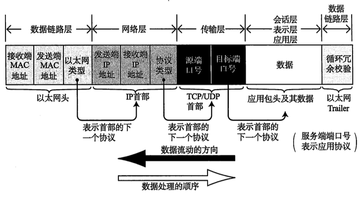

校招还没正式开始,就已经收到很多HR的邮件了,所以复习要抓紧了.今天来复习一下网络知识.

###OSI分层
分层的方法有很多种:五层OSI模型就是, application layer,
transport layer, Network layer, Link Layer, Physical Layer.
前四层对应的单位是message(消息), segment(段),datagram(数据包),frame(帧).

###数据链中包的结构
[接受和发送方mac地址,以太网协议,发送和接收端IP地址,协议类型,远端口和目标端口号,数据,循环冗余校检]

###Transport layer
Transport layer是process间的logical communication.
把aplication-layer messages分解成trasport-layer segments.
IP protocal 是best-effort delivery service, unreliable service.
从host-host到process-process称为运输层复用(transport-layer multiplexing).

TCP是reliable data transfer, congestion control.
建立TCP连接的时候,会确定最大消息长度,MSS: maximum segment size.最理想的情况正好是IP中不会被分片处理的最大长度.
####窗口大小
窗口大小就是指无需等待确认应答而可以继续发送数据的最大值.使用缓冲区,可以对多个段同时确认应答,确认后就可以从缓冲区删除.
####窗口控制和窗口重发
接收方会确认下一个需要接受的段,大于这个编号的段会放在接收方的缓存区.发送方收到一个应答之后,就代表比这个编号小的数据都收到了,如果收到三个重复的应答,则要重发数据,这就是高速重发.
####流控制
接收方通过告诉发送方窗口大小来控制发送的数据量,在每一个tcp段中都有一个窗口大小的字段.
####拥塞控制
因为某个网络的带宽是有限的,如果某个计算机突然发送大量数据,可能会造成拥塞. 发送方有一个拥塞窗口的大小,从1开始,每接受一个应答就加1,发送拥塞窗口和接受到的窗口大小的较小值的数据量.在慢启动阈值前,拥塞窗口大小指数增长,之后直线增长.当高速重发触发时,慢启动阈值被设置为当前窗口的一半,然后窗口大小=阈值+3段