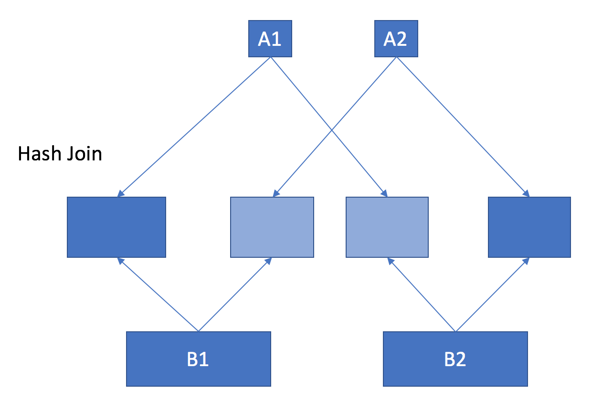
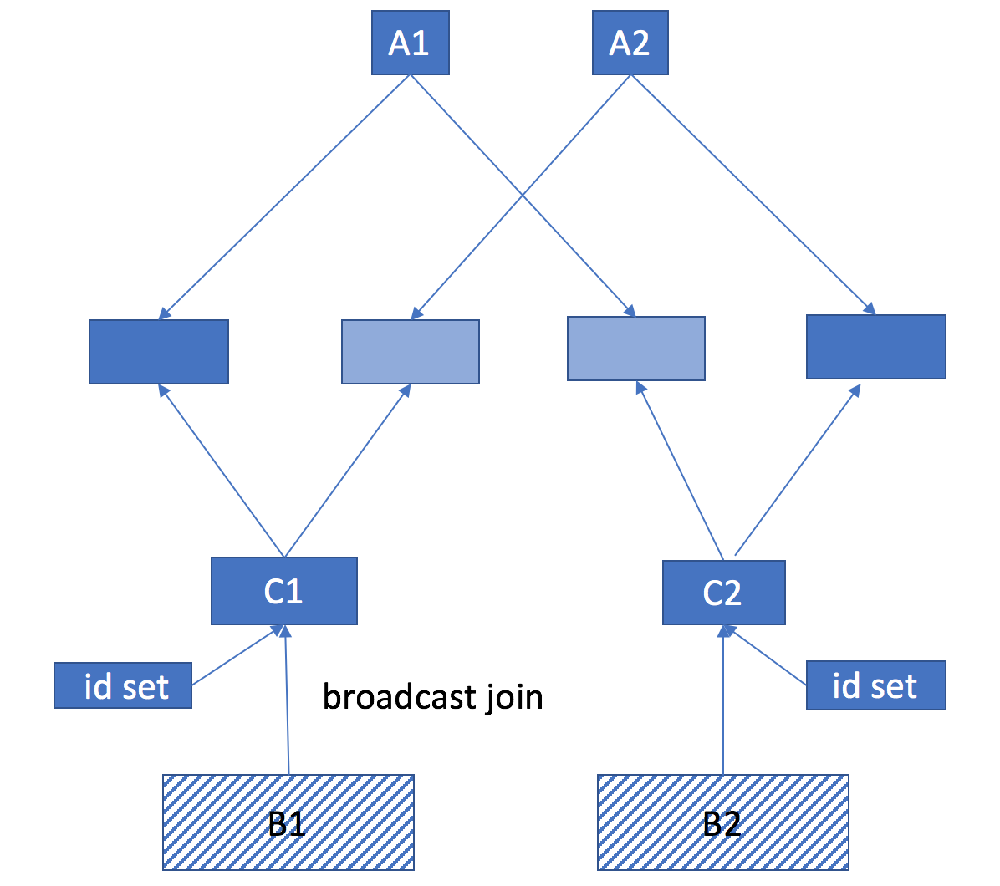
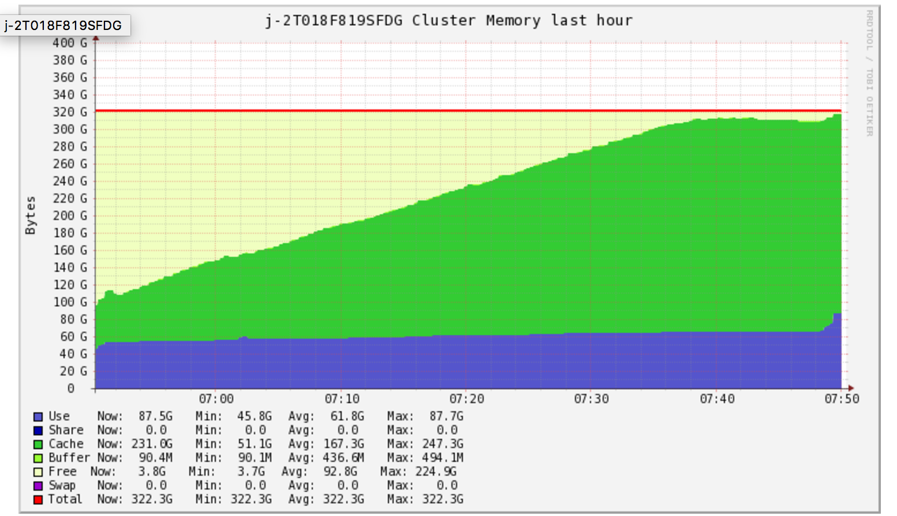

最近在项目中用Spark join了几十亿的数据，在debug和不断优化性能中感觉收获良多，特此记录一下。


任务很简单，就是join两张表，表A ship有几千万行，包含每日寄出去的包裹的信息，表B item有几十亿行，包括所有商品的属性，我们需要把商品的属性信息加到每个包裹里面的商品上。

一开始我就是把它当成一个很简单的任务，不就是一个简单的left join吗？于是写下了如下代码：

```java
Dataset<Row> shipItems = getSpark().sql("select " +
        "ship.*, item.* " +
        "from ship left join item " +
        "on ship.asin = item.item_asin")
        .drop("item_asin");
shipItems.createOrReplaceTempView("ship_items");
```

但是一经实践就遇到一下错误：

```
17/07/10 02:26:14 ERROR YarnClientSchedulerBackend: Yarn application has already exited with state KILLED!
17/07/10 02:26:14 INFO SparkUI: Stopped Spark web UI at http://172.31.5.203:4040
17/07/10 02:26:14 ERROR TransportClient: Failed to send RPC 8654033690236908099 to /172.31.5.177:42830: java.nio.channels.ClosedChannelException
java.nio.channels.ClosedChannelException
        at io.netty.channel.AbstractChannel$AbstractUnsafe.write(...)(Unknown Source)
17/07/10 02:26:14 ERROR YarnSchedulerBackend$YarnSchedulerEndpoint: Sending RequestExecutors(0,0,Map()) to AM was unsuccessful
java.io.IOException: Failed to send RPC 8654033690236908099 to /172.31.5.177:42830: java.nio.channels.ClosedChannelException
```

这个错误表明spark的任务在Yarn的executor中被kill了，然后在看一下Yarn executor中的log :"WARN: Received singal SIG_TERM", 果然因为内存使用太多被Yarn kill了。

这是为什么呢？来估算一下完成这个任务需要多少计算资源吧。假设每个表大概有50字段，每个字段占用10个字符，那么当Spark将表A load进内存时需要50*10*10^7/10^9 = 5G,而将表B load进内存时需要：50*10*10^9/1000^9 = 500G。但是当我把整个集群的内存加到600G的时候这个错误仍然没有解决。猜测内存600G的集群仍然无法join表A和表B可能是因为在join过程中可能生成了多份数据而超过了表A和表B本来的大小，这个时候如果再继续提高集群大小就有点不划算了，所以我们开始考虑如何对程序进行优化。

此时该程序所需内存如下所示：

其中深蓝色代表已经存在于集群中内存中的数据，浅蓝色代表正在生成中的数据，那么此时整个集群所需要的内存为两倍于表A和表B大小：(500 + 5) * 2 ＝ 2010 G.


因为我们表A left join 表B 之后的结果和表A的大小是一样的，所以实际上大部分表B的数据是没有用的，那么我们可不可以先将一部分表B的数据去掉呢？我们可以确定的是只有存在于表A中物品才会出现在结果中，所以我们可以将表A中的所有商品ID取出来做成一个集合，这个集合的大小为 20 * 10^7/1000/1000 = 200 M，然后将这个集合broadcast到每一个slave节点进行filter，这样可以得到一个大大缩减版的表B。更重要的是，我们得到缩减版的表B之后，原来那个巨大的表B就可以从内存中删除了，这样可以大大减少内存的使用，最终使得程序成功运行。优化之后的代码如下：

```java
Dataset<Row> distinctAsin = getSpark()
        .sql("select distinct asin from ship")
        .persist(StorageLevel.DISK_ONLY())
//only keep items appeared in shipments
Dataset<Row> filteredItems = getSpark()
        .sql("select * from item")
        .withColumnRenamed("asin", "item_asin")
        .join(functions.broadcast(distinctAsin),
                functions.col("item_asin").equalTo(functions.c("asin")), "leftsemi")
        .persist(StorageLevel.DISK_ONLY());
filteredItems.createOrReplaceTempView("filter_item");
Dataset<Row> shipItems = getSpark().sql("select " +
        "ship.*, filter_item.* " +
        "from ship left join filter_item " +
        "on ship.asin = filter_item.item_asin")
        .drop("item_asin");
shipItems.createOrReplaceTempView("ship_items");
```

此时该程序所需的内存如下：

其中深蓝色代表已经存在于集群中内存中的数据，浅蓝色代表正在生成中的数据，蓝色阴影代表已经处理过从内存中删除的数据，那么此时整个集群所需要的内存为两倍于表A和表C大小：(5 + 5) * 2 ＝ 20 G.


通过gangalia监控到的集群内存使用量.

